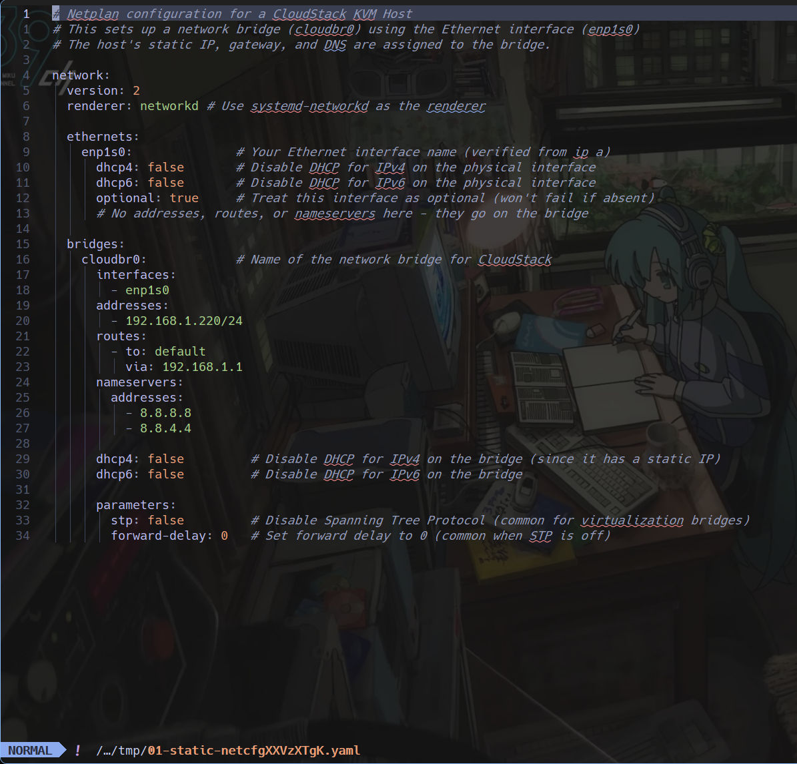
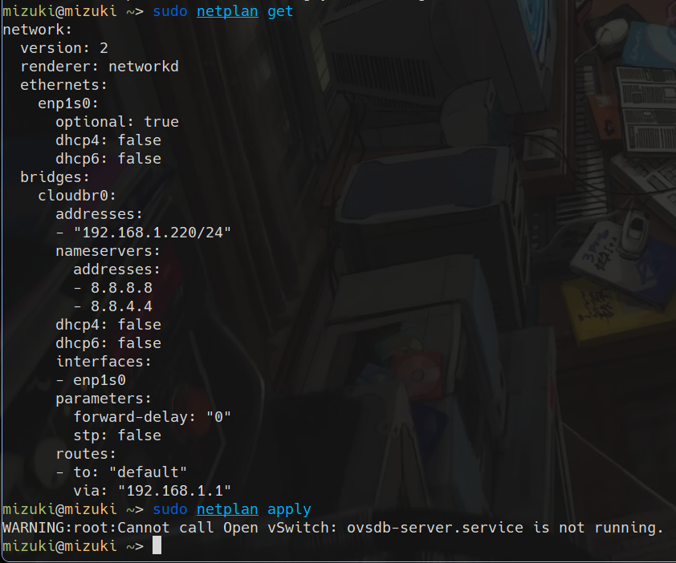

# Network Configuration

- [Network Configuration](#network-configuration)
  - [Netplan](#netplan)
    - [Netplan Command](#netplan-command)
    - [Netplan Explanation](#netplan-explanation)
    - [Netplan Notes](#netplan-notes)
  - [Change the IP](#change-the-ip)
    - [IP Change Explanation](#ip-change-explanation)
    - [IP Change Notes](#ip-change-notes)
    - [Netplan Image](#netplan-image)
  - [Confirm Netplan](#confirm-netplan)
    - [Confirm Netplan Explanation](#confirm-netplan-explanation)
    - [Confirm Netplan Notes](#confirm-netplan-notes)
    - [Netplan Apply Image](#netplan-apply-image)
  - [Validation](#validation)

The netplan configuration is similar to the network/wifi setting in Ubuntu Desktop/Windows, but we edit it using a file.

In this step, we will configure the network settings for the host. The host will be connected to the internet using a bridge interface. The bridge interface will be used for all network traffic on the host. The bridge interface will be created using the `cloudbr0` network interface.

## Netplan

### Netplan Command

```bash
cd /etc/netplan
sudo -e /etc/netplan/01-static-netcfg.yaml
```

### Netplan Explanation

- `cd path` changes the directory to the specified path.
- `sudo -e filename` opens the file in the default editor. The default should be `nano`, but we've changed it to `nvim` in the `~/.bashrc` file.

### Netplan Notes

- The netplan configuration might be named differtly, such as `00-installer-config.yaml` or `50-cloud-init.yaml`. The name is not important, but the file should be in the `/etc/netplan` directory.
- If there is multiple files in the `/etc/netplan` directory, the file with the smallest number will be used. The files are processed in alphabetical order, so `00-installer-config.yaml` will be processed before `50-cloud-init.yaml`. If there are multiple files, the last one will be used. So if you have multiple files, make sure to edit the correct one.

## Change the IP

Change the netplan configuration to the following. The IP address should be the same as the one you set in the `cloudbr0` bridge in the `cloudbr0` network interface.

```yaml
# This is the network config written by 'subiquity'
network:
  version: 2
  renderer: networkd

  ethernets:
    enp0s3:
      dhcp4: false
      dhcp6: false
      optional: true

  bridges:
    cloudbr0:
      interfaces: 
        - enp0s3
      addresses: 
        - 192.168.1.220/24 #Your host IP address
      routes:
        - to: default
          via: 192.168.1.1
      nameservers:
        addresses: 
          - 8.8.8.8
          - 8.8.4.4

      dhcp4: false
      dhcp6: false

      parameters:
        stp: false
        forward-delay: 0
```

### IP Change Explanation

Bridge `cloudbr0` is created with the following settings:

- `interfaces`: The interface to be bridged. We enslave the `enp0s3` interface to the `cloudbr0` bridge, which means that the `cloudbr0` bridge will be used for all network traffic on the `enp0s3` interface.
- `addresses`: The IP address of the host. This should be the same as the one you set in the `cloudbr0` bridge in the `cloudbr0` network interface.
- `routes`: The default route for the host
- `nameservers`: The DNS servers for the host.
- turn of dhcp using `dhcp4: false` and `dhcp6: false`
- `stp: false` and `forward-delay: 0` are used to speed up the bridge connection. This is not necessary for a single host, but it can help in some cases.

### IP Change Notes

- For cloudstack installation, wifi cannot be used. The wifi interface cannot be enslaved to the bridge. There might be a workaround treating the wifi interface as a proxy interface, but using LAN is easier.
- For Ubuntu Desktop, the network renderer is `NetworkManager`, be sure to choose the coorrect renderer. The default renderer for Ubuntu Desktop is `NetworkManager`, and for Ubuntu Server it is `networkd`.
- Using dhcp is possible, but it is not recommended. Later on in the dashboard setup, if the host IP is requested, `127.0.0.1` can be used. But it is more convenient to use a static IP address and input the host IP address in the dashboard setup.

### Netplan Image



## Confirm Netplan

After editing the netplan configuration, confirm the changes using the following commands:

```bash
sudo netplan get
sudo netplan apply
```

### Confirm Netplan Explanation

- `sudo netplan get` shows the current netplan configuration. If the configuration is correct, it should show the same configuration as the netplan file you edited without comments or blank lines.
- `sudo netplan apply` applies the changes to the network configuration. This will restart the network service and apply the changes.

### Confirm Netplan Notes

- Be careful when using `sudo netplan apply`, if the configuration is incorrect, you might lose the connection to the host when using SSH. If this happens, you need to edit the netplan configuration file directly on the host machine.
- When using `sudo netplan apply`, a warning might show `WARNING:root:Cannot call open vSwitch...`, this is normal and can be ignored. This is because the `cloudbr0` bridge is not an open vSwitch bridge, but a normal Linux bridge.

### Netplan Apply Image



## Validation

After applying the changes, check the network configuration using the following commands:

```bash
ip a
```

This command will show the current network configuration. The `cloudbr0` bridge should be up and running with the correct IP address. The `enp0s3` interface should be empty and not have an IP address.

```
ping 1.1.1.1 -c 16
# or
ping 8.8.8.8 -c 16
```

This command will ping the internet to check if the network is working. If the ping is successful, the network is working correctly.
