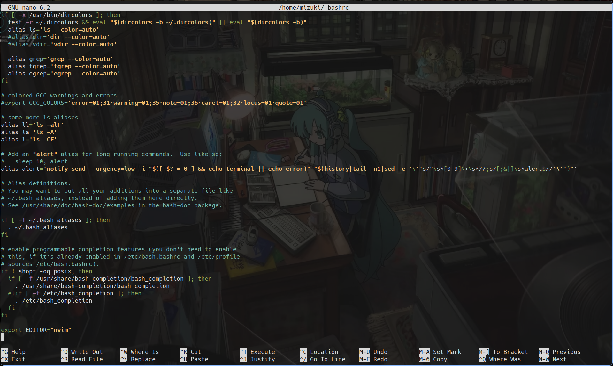
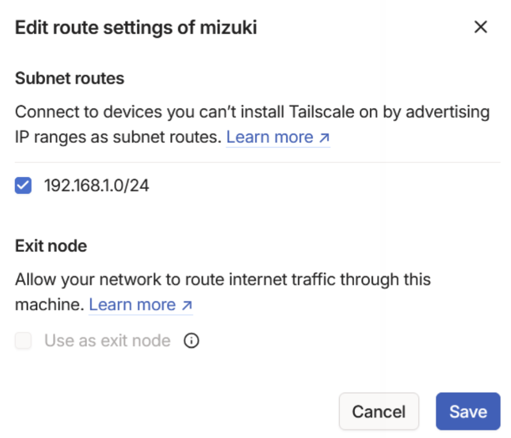
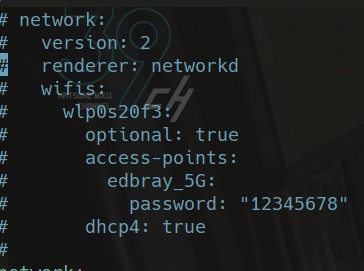

# Utils Set Up

In this section, we will set up some tools that will help in the installation process. These tools are not required for the installation, but they will make the installation process easier and more convenient.

## Table of Contents

- [Utils Set Up](#utils-set-up)
  - [Table of Contents](#table-of-contents)
  - [LazyVIm](#lazyvim)
  - [Configure LazyVim](#configure-lazyvim)
  - [Default Editor Configuration](#default-editor-configuration)
  - [SSH Configuration](#ssh-configuration)
    - [Confirm SSH is Installed](#confirm-ssh-is-installed)
    - [Enable SSH Root Login](#enable-ssh-root-login)
    - [Check the SSH Configuration](#check-the-ssh-configuration)
  - [Tailscale Configuration](#tailscale-configuration)
    - [Install Tailscale](#install-tailscale)
    - [Start Tailscale](#start-tailscale)
    - [Advertise Tailscale Routes](#advertise-tailscale-routes)
    - [Confirm Tailscale](#confirm-tailscale)
    - [Using Tailscale](#using-tailscale)
  - [Wi-Fi Configuration](#wi-fi-configuration)
    - [Edit Netplan Configuration](#edit-the-netplan-configuration)
    - [Add Wi-Fi Configuration](#add-the-wi-fi-configuration)
    - [Apply New Configuration](#apply-the-configuration)
    - [Check the Connection](#check-if-youre-connected-to-the-internet)
    - [Additional Notes](#additional-notes)

## LazyVim

A configuration for Neovim that is easy to use and has a lot of features. This is the preference for one of our team members.

```bash
sudo snap install nvim --classic
sudo apt install gcc git xclip
sudo mkdir ~/.config/nvim
sudo git clone https://github.com/LazyVim/starter ~/.config/nvim
```

## Configure LazyVim

Open neovim and wait for the installation to finish

```bash
nvim
```

If the LazyVim installation is successful, you should see a screen like this:


Wait for the installation to finish. It might take a while. After everything is downloaded, close neovim and open it again.

You can open a file using the following command:

```bash
nvim <filename>
# Example
nvim /etc/netplan/00-installer-config.yaml
```

## Default Editor Configuration

When editing a protected file, you will need to use `sudo` to edit the file. But, when you use `sudo nvim`, the LazyVim configuration will not be loaded. To fix this, we need to set the `EDITOR` environment variable to `nvim`.

to do this, we need to add the following line to the `~/.bashrc` file:

```bash
export EDITOR="nvim"
```



This will set the `EDITOR` environment variable to `nvim` when you open a terminal. We can then use `sudo -e <filename>` or `sudoedit <filename>` to edit the file with LazyVim.

## SSH Configuration

### Confirm SSH is Installed

To check if SSH is installed, run the following command:

```bash
sudo apt install openssh-server
```

### Enable SSH Root Login

To enable SSH root login, we need to edit the SSH configuration file. To do this, run the following command:

```bash
sed -i '/#PermitRootLogin prohibit-password/a PermitRootLogin yes' /etc/ssh/sshd_config
#restart ssh service
service ssh restart
#or
systemctl restart sshd.service
```

Root login is not required for the installation, but it is recommended to enable it for easier access to the host.

### Check the SSH Configuration

```bash
sudo -e /etc/ssh/sshd_config
```

Find the PermitRootLogin and make sure to set it to 'yes'

## Tailscale Configuration

Tailscale is a VPN service that allows you to connect (SSH) to your host from anywhere as long as you have internet access. It is recommended to use Tailscale for easier access to the host.

### Install Tailscale

To install or confirm Tailscale, run the following command:

```bash
sudo snap install tailscale
```

### Start Tailscale

To start Tailscale, run the following command:

```bash
sudo tailscale up
```

This will start Tailscale and give you a URL to authenticate your device. Open the URL in the browser of your personal computer and log in with your Tailscale account. After logging in, a confirmation message will show up in the terminal.

### Advertise Tailscale Routes

If your host needs to act as a subnet router or use Tailscale tagging, you can enable advertising:
```bash
sudo tailscale up --advertise-routes=192.168.1.0/24
```
> Replace 192.168.1.0/24 with the subnet you want the host to route traffic for. After running the command above, open the Tailscale Admin Console, select your device (e.g., mizuki), and enable the advertised route by checking the box like below:



### Confirm Tailscale

To check if Tailscale is running, run the following command:

```bash
tailscale status
```

This will show you the status of Tailscale and the IP address of your host.

In your personal computer, you can check the Tailscale IP address by running the same command or by using the Tailscale app.

### Using Tailscale

You can use Tailscale to SSH into your host using the Tailscale IP address. To do this, first check the Tailscale IP address using the tailscale app or `tailscale status` command. Then, use the following command to SSH into your host:

```bash
ssh <username>@<tailscale-ip>
#Example
ssh root@100.82.42.88
```

This will SSH into your host using the Tailscale IP address. You can also use the Tailscale IP address to access the web interface of the host. Later on, we will need to open the web interface to access the CloudStack dashboard. This can be done by inputting the Tailscale IP address in the browser of your personal computer.

Example: `http://100.82.42.88:8080`

## Wi-Fi Configuration

You only need to set this configuration when Ethernet is unavailable or inconvenient, for example:

  - If your device lacks a physical Ethernet port,
  - When the Ethernet port is difficult to access, or
  - When you frequently move the device between locations.

This action is recommended because Wi-Fi offers greater flexibility in these scenarios compared to constantly plugging and unplugging an Ethernet cable. This method would allow the system to connect automatically to Wi-Fi on boot without relying on an Ethernet cable.

### Edit the netplan configuration:
```bash
cd /etc/netplan
sudo -e /etc/netplan/01-static-netcfg.yaml
```

### Add the wi-fi configuration:
```yaml
network:
  version: 2
  renderer: networkd
  wifis:
    wlp0s20f3:
      optional: true
      access-points:
        "edbray_5G":
          password: "12345678"
      dhcp4: true
```
> Replace `wlp0s20f3` with your actual Wi-Fi interface name. You can check it using `ip a` or `iw dev`.



### Apply the configuration:
After saving the file (`Ctrl+O`, `Enter`, then `Ctrl+X` to exit), run:
```bash
sudo netplan apply
```

### Check if you're connected to the internet:
```bash
ping 8.8.8.8
```
> If you receive replies, the setup was successful.

### Additional Notes
If `netplan apply` fails, try rebooting the system:
```bash
sudo reboot
```

To troubleshoot Wi-Fi connection issues, view the network logs with:
```bash
journalctl -u systemd-networkd
```
