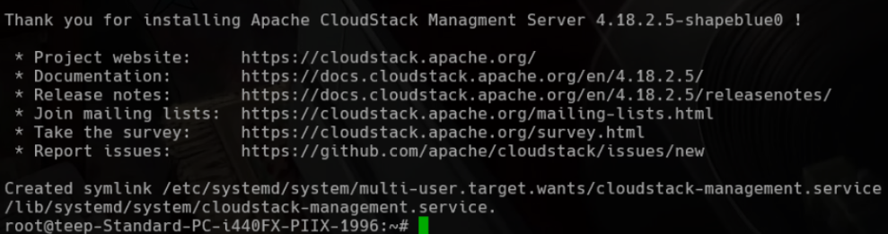
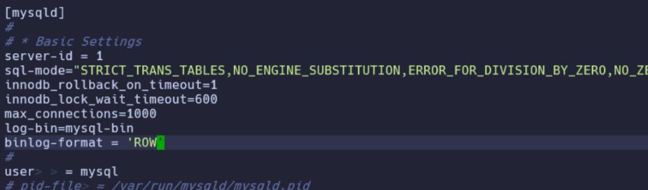
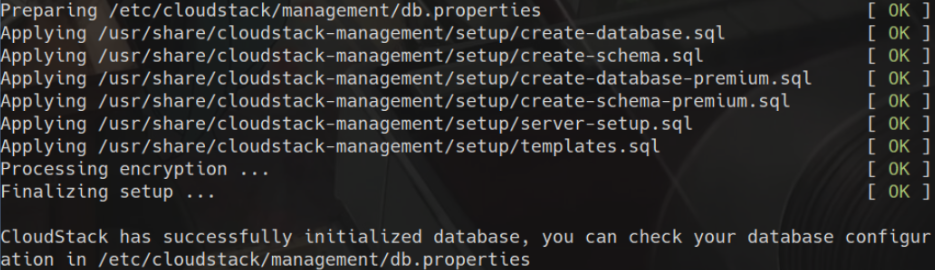

# Cloudstack Installation

## Table of Contents

- [Cloudstack Installation](#cloudstack-installation)
  - [Table of Contents](#table-of-contents)
  - [Add CloudStack Repository and GPG Key](#add-cloudstack-repository-and-gpg-key)
  - [Installing Cloudstack and Mysql Server](#installing-cloudstack-and-mysql-server)
    - [Installing Cloudstack and Mysql Server](#installing-cloudstack-and-mysql-server-1)
  - [Configure Mysql Config File](#configure-mysql-config-file)
  - [Restart and check mysql service status](#restart-and-check-mysql-service-status)
  - [Deploy Database as Root and create user name and password](#deploy-database-as-root-and-create-user-name-and-password)
  - [Setup NFS Server and Storage Directories](#setup-nfs-server-and-storage-directories)
    - [Install NFS Kernel Server and Quota Support.](#install-nfs-kernel-server-and-quota-support)
    - [Configure Primary and Secondary Storage Directories.](#configure-primary-and-secondary-storage-directories)
  - [Configure NFS Server](#configure-nfs-server)
    - [Additional Information](#additional-information)
    - [Explanation of NFS Commands](#explanation-of-nfs-commands)
  - [Setup Validation](#setup-validation)
  - [Common Errors and Fixes](#common-errors-and-fixes)
  - [Possible Warning and is it Safe to Ignore?](#possible-warning-and-is-it-safe-to-ignore)


## Add CloudStack Repository and GPG Key

Add the official CloudStack repository and its GPG key to allow package installation.

```bash
sudo -i
mkdir -p /etc/apt/keyrings
wget -O- http://packages.shapeblue.com/release.asc | gpg --dearmor | sudo tee /etc/apt/keyrings/cloudstack.gpg > /dev/null
echo deb [signed-by=/etc/apt/keyrings/cloudstack.gpg] http://packages.shapeblue.com/cloudstack/upstream/debian/4.18 / > /etc/apt/sources.list.d/cloudstack.list
```

## Installing Cloudstack and Mysql Server

Update package index and install the CloudStack Management Server and MySQL.

### Installing Cloudstack and Mysql Server

Update package index and install the CloudStack Management Server and MySQL.

```bash
sudo apt-get update -y
sudo apt-get install cloudstack-management mysql-server
```



## Configure Mysql Config File

Use the following command to open the MySQL configuration file in edit mode:

```bash
sudo -e /etc/mysql/mysql.conf.d/mysqld.cnf
```

Inside the `mysqld` section of the file, add or update the following lines:

```bash
server-id = 1
sql-mode="STRICT_TRANS_TABLES,NO_ENGINE_SUBSTITUTION,ERROR_FOR_DIVISION_BY_ZERO,NO_ZERO_DATE,NO_ZERO_IN_DATE,NO_ENGINE_SUBSTITUTION"
innodb_rollback_on_timeout=1
innodb_lock_wait_timeout=600
max_connections=1000
log-bin=mysql-bin
binlog-format = 'ROW'
```

Parameters Explanation:

- `server-id = 1`: Sets a unique server ID (important for replication setups).
- `sql-mode`: Enforces strict SQL rules for data integrity.
- `innodb_rollback_on_timeout = 1`: Rolls back the entire transaction if a lock wait times out.
- `innodb_lock_wait_timeout = 600`: Sets the lock wait timeout to 600 seconds.
- `max_connections = 1000`: Allows up to 1000 simultaneous connections.
- `log-bin = mysql-bin`: Enables binary logging (used in replication and point-in-time recovery).
- `binlog-format = 'ROW'`: Sets binary logging format to row-based logging (required for some replication setups).



## Restart and check mysql service status

Restart MySQL to apply changes and verify it's running.

```bash
systemctl restart mysql
systemctl status mysql
```

> If you see the output contains `active (running)`, this indicates that the MySQL service has started successfully and is functioning properly.

## Deploy Database as Root and create user name and password

Deploy the CloudStack database using root credentials and set up the default user.

```bash
cloudstack-setup-databases cloud:cloud@localhost --deploy-as=root:teep1 -i 192.168.1.220
```



## Setup NFS Server and Storage Directories

### Install NFS Kernel Server and Quota Support.

```bash
sudo su
apt-get install nfs-kernel-server quota
```

> This installs the NFS server and quota management tools, which are essential for setting up and managing shared storage.

### Configure Primary and Secondary Storage Directories.

```bash
sudo su
echo "/export  *(rw,async,no_root_squash,no_subtree_check)" > /etc/exports
mkdir -p /export/primary /export/secondary
exportfs -a
```

> This creates the primary and secondary shared storage directories, and adds the export rule so it can be accessed by NFS clients.

## Configure NFS Server

Edit default NFS service configuration to use fixed ports and enable services.

```bash
sudo su
sed -i -e 's/^RPCMOUNTDOPTS="--manage-gids"$/RPCMOUNTDOPTS="-p 892 --manage-gids"/g' /etc/default/nfs-kernel-server
sed -i -e 's/^STATDOPTS=$/STATDOPTS="--port 662 --outgoing-port 2020"/g' /etc/default/nfs-common
echo "NEED_STATD=yes" >> /etc/default/nfs-common
sed -i -e 's/^RPCRQUOTADOPTS=$/RPCRQUOTADOPTS="-p 875"/g' /etc/default/quota
service nfs-kernel-server restart
exit
```

### Additional Information

- Use the correct local/bridged ip for the -i parameter during database deployment
- CloudStack must be installed on a system using systemd.
- It's recommended to have an internal DNS or proper hostname resolution.

### Explanation of NFS Commands

- `sed` commands configure spesific daemon ports to avoid conflicts with firewalls
- `echo "NEED_STATD=yes"` ensures the statd service runs when NFS starts.
- service nfs-kernel-server restart applies the changes.

## Setup Validation

Run these command to ensure everything is properly set up

1. Check if MySQL is listening on port 3306:

```bash
ss -tulnp | grep 3306
```

2. Verify Cloudstack database Exist:

```bash
mysql -u cloud -pcloud -e "show databases;"
```

3. Check Cloudstack management service status

```bash
systemctl status cloudstack-management
```

4. Monitor Cloudstack logs

```bash
tail -f /var/log/cloudstack/management/management-server.log
```

## Common Errors and Fixes

| Error Message                                   | Likely Cause                        | Solution                                                       |
| ----------------------------------------------- | ----------------------------------- | -------------------------------------------------------------- |
| `Access denied for user 'cloud'@'localhost'`    | Incorrect database user or password | Ensure you used the correct format: `cloud:cloud@localhost`    |
| `cloudstack-setup-databases: command not found` | CloudStack not installed correctly  | Reinstall: `apt-get install --reinstall cloudstack-management` |
| MySQL fails to restart due to `sql-mode`        | Syntax or formatting error          | Use double quotes (`"`) around the entire value                |
| NFS export not visible                          | Export not applied or paths missing | Make sure `/export/...` exists and run `exportfs -a`           |
| `rpc.mountd` port conflict                      | Port already in use                 | Change to a different unused port in the NFS config            |

## Possible Warning and is it Safe to Ignore?

| Warning / Message                                     | Safe to Ignore? | Notes                                                                |
| ----------------------------------------------------- | --------------- | -------------------------------------------------------------------- |
| `Warning: Using a password on the command line`       | Yes             | Just a security notice when using passwords in CLI                   |
| `systemd: Detected architecture`                      | Yes             | Informational, not a problem                                         |
| `cloudstack-setup-databases: database already exists` | Depends         | Safe if it's an intentional redeploy. Otherwise, check for conflicts |
| `rpc.statd not running but is required`               | No              | Ensure `NEED_STATD=yes` is set and restart `nfs-common`              |
