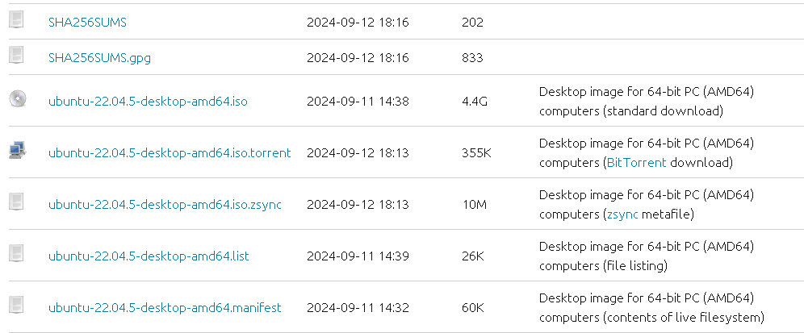
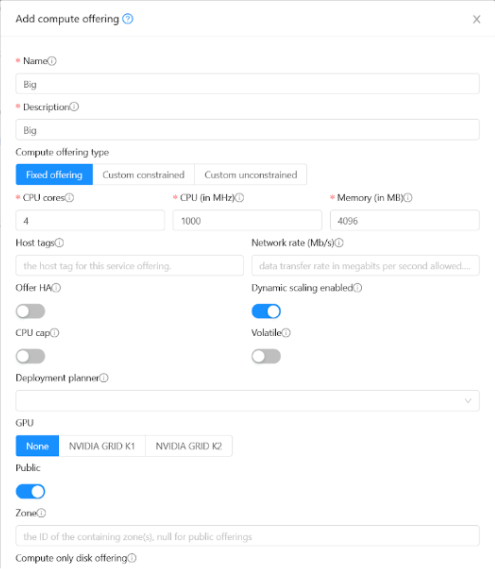
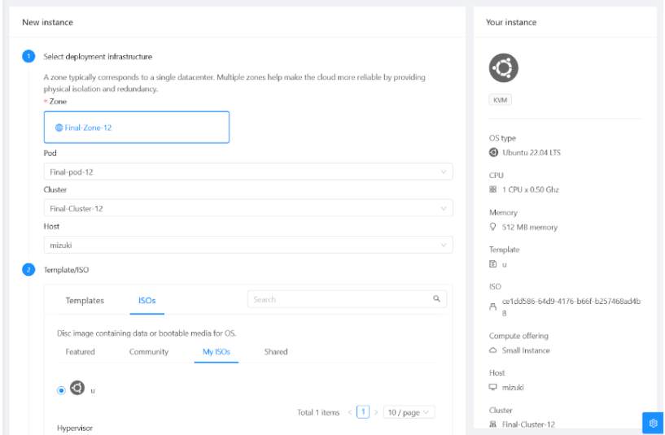
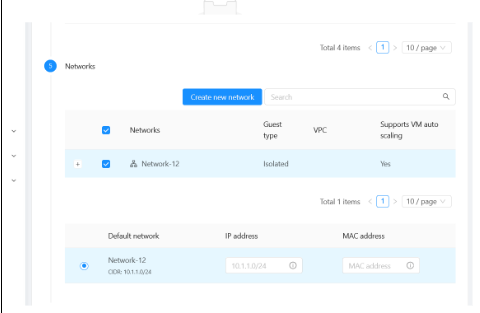
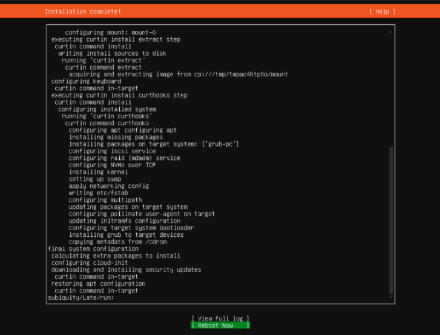

# CloudStack Configuration and VM Installation

- [Download ISO](#download-iso)
- [Create Compute Offering](#create-compute-offering)
- [Create New Instance](#create-new-instance)
- [Configure Network](#configure-network)
- [Launch Instance](#launch-instance)
- [Ubuntu Server Installation](#ubuntu-server-installation)
- [Common Error and Warning](#common-errors-and-warnings)

In this section, we will go through the basic steps to configure Apache CloudStack and launch a virtual machine (VM). These steps include downloading the necessary ISO file, setting up compute resources, configuring the network, and deploying your first instance.

## Download ISO

Download the ISO file for the operating system you want to install on your VM.

Upload or register an operating system ISO in CloudStack:

1. Go to **Templates > ISOs** in the CloudStack dashboard.
2. Click **Register ISO**.
3. Provide the URL or upload manually.
4. Select the correct OS type and zone.

You can download the iso from here, if you want to use a direct link, make sure that it is a direct link to the ISO file (ussually ends with `.iso` ). For example, for Ubuntu Server 22.04:

```bash
https://releases.ubuntu.com/jammy/ubuntu-22.04.5-live-server-amd64.iso
```



## Create Compute Offering

A Compute Offering defines the CPU, memory, and other compute resources allocated to virtual machines. Here is how to do it

1. Navigate to Service Offerings > Compute Offerings.
2. Click Add Compute Offering.
3. Enter name, description, CPU, and RAM details.
4. Save and confirm availability in the desired zone.

For step 3 Fill in the Details:

| Field                   | Value            |
| ----------------------- | ---------------- |
| Name                    | `big`            |
| Description             | `big`            |
| Compute Offering Type   | `Fixed Offering` |
| CPU Cores               | `4`              |
| CPU (MHz)               | `1000`           |
| Memory (MB)             | `4096`           |
| Dynamic Scaling Enabled | `On`             |
| GPU                     | `None`           |
| Public                  | `Yes`            |

After creating the compute offering, it becomes selectable during instance creation. This offering defines how powerful the VM will be in terms of CPU and memory resources.



## Create New Instance

Start creating your VM:

1. Go to Instances > Add Instance.
2. Choose the zone where you want to deploy.
3. Select the ISO registered earlier.
4. Choose the compute offering you created.
5. Create or select a disk offering to allocate storage space.



**Select Deployment Infrastructure**

- **Zone**: `<your zone name>` Ex: `Final-Zone-12`
- **Pod**: `<your pod name>` Ex: `Final-Pod-12`
- **Cluster**: `<your cluster name>` Ex: `Final-Cluster-12`
- **Host**: `<your host name>` Ex: `mizuki`

---

**Template/ISO**

- Click the `ISO` tab
- Choose from **My ISOs**
- Select your downloaded ISO

---

By completing this step, you're defining the basic structure of the VM. The next step is making sure it has proper networking.

## Configure Network

At this point, you need to ensure your VM can connect to the internal or external network. If you don’t already have an existing network in CloudStack, you will need to create one. This step is essential to allow communication between your VM, other instances, and potentially the internet.

### If you don’t have an existing network, create an Isolated Network:

| Field | Value           |
|-------|-----------------|
| Name  | network-12      |
| Zone  | final-zone-12   |

### Configure Instance Details

When setting up the instance that will use this network, you’ll be asked for some additional configuration details:

| Field             | Value                 |
|------------------|-----------------------|
| Name              | `mizu7`               |
| Keyboard Language | Standard US Keyboard |



Once this step is complete, your instance will be attached to the specified network and ready for communication. This setup ensures the VM has the right environment to operate in and be accessible if required.

## Launch Instance

Click Launch Instance to finalizes your configuration and deploys your virtual machine, making it active and ready to use within the selected zone and network.

## Ubuntu Server Installation

This section covers the installation process for Ubuntu Server on your newly launched VM. Follow the on-screen instructions provided by the Ubuntu installer to complete the setup, including language selection, user creation, and disk configuration.

After the installation is complete, you will be prompted to reboot the system. Once the reboot prompt appears, you can safely **detach the ISO** from the Instance page in CloudStack to ensure the VM boots from the virtual disk instead of restarting the installer.





### Installation Complete

Congratulations! You have successfully installed a Virtual Machine on your CloudStack environment. At this stage, your VM is running and accessible via the CloudStack web console.

However, if you try to access external resources (e.g., using `ping 8.8.8.8`), you will notice that internet connectivity is not yet available. This is expected because the external network has not been fully configured. Further networking steps (such as setting up virtual routers, NAT, or firewall rules) are required if you want the VM to connect to the internet. We will cover this part in the next part

## Common Errors and Warnings

During installation or configuration, you may encounter some errors or warnings. Here are some common ones and whether you should ignore them or take action:

| Error / Warning Message                          | Should You Ignore? | Explanation / Action                                                                 |
|--------------------------------------------------|---------------------|--------------------------------------------------------------------------------------|
| `No network connectivity`                        | ✅ Yes (for now)     | Expected before full network setup. Can be fixed after configuring CloudStack router/NAT. |
| `ISO did not detach after reboot`               | ❌ No               | Go to the Instance → Storage → Detach ISO manually to avoid boot loop.              |
| `Host not found` when trying to ping external IP | ✅ Yes (initially)  | Until DNS or gateway is properly configured, this is expected.                      |
| CloudStack UI shows VM as `Running` but no access | ✅/❌ Depends       | Check firewall/security group and console access; if needed, restart the instance.  |
| `Permission Denied` when accessing via SSH       | ❌ No               | Likely a credentials or key issue. Check your SSH key setup or user/password.       |

If you're unsure about any error, it's always best to document it and check CloudStack logs or UI messages for additional context.
