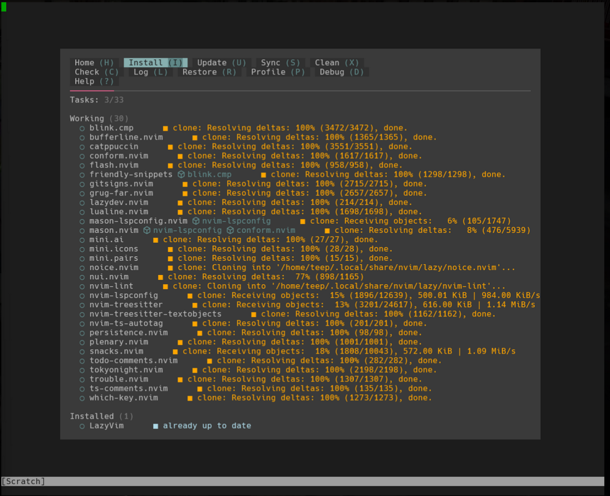

# Utils Set Up

## LazyVIm

A configuration for Neovim that is easy to use and has a lot of features. This is the preference for one of our team members.

```bash
sudo snap install nvim --classic
sudo apt install gcc git xclip
mkdir ~/.config/nvim
git clone https://github.com/LazyVim/starter ~/.config/nvim
```

## Configure LazyVim

Open neovim and wait for the installation to finish

```bash
nvim
```

If the LazyVim installation is successful, you should see a screen like this:



Wait for the installation to finish. It might take a while. After everything is downloaded

## SSH Configuration

### Enable SSH Root Login

```bash
sed -i '/#PermitRootLogin prohibit-password/a PermitRootLogin yes' /etc/ssh/sshd_config
#restart ssh service
service ssh restart
#or
systemctl restart sshd.service
```

### Check the SSH Configuration

```bash
nano /etc/ssh/sshd_config
```

Find the PermitRootLogin and make sure to set it to 'yes'